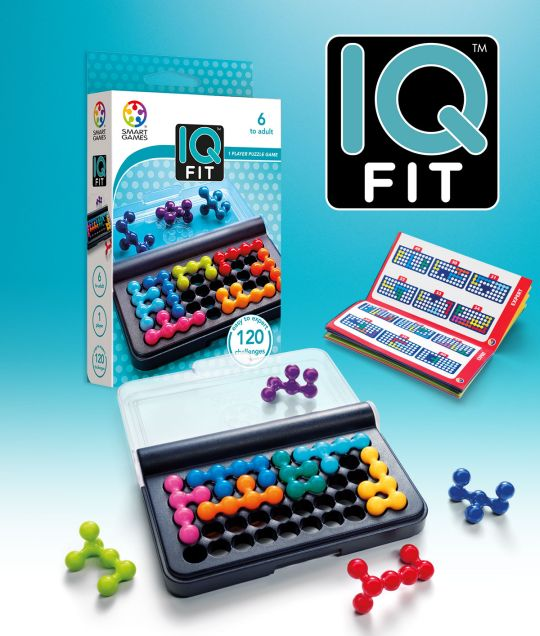
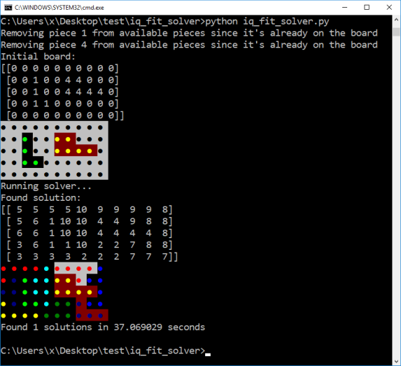

# IQ Fit Game Solver

A brute force solver for the IQ Fit game.  Finds all solutions to a given
initial board using the 10 pieces supplied with the game.  If the inital board
is empty, finds all possible solutions (eventually).

 

See [iq_fit_solver.py](iq_fit_solver.py) for instructions on usage.